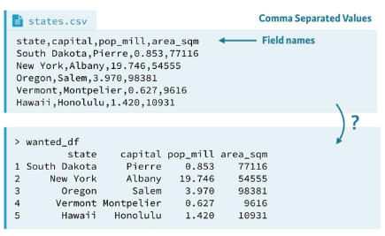

# Importing Data with R

Anotações para o [curso do Datacamp](https://www.datacamp.com/courses/importing-data-in-r-part-1) ministrado pelo Filip Schouwenaars.

Aqui aprenderemos a importar dados no R para começar análises. Estaremos trabalhando com variados tipos de arquivos.

## Importing data from flat files with utils

O que faremos quando precisamos transitar de Excel para R?
Nesse curso aprenderemos a trabalhar com dados de 5 tipos de dados:
 
 1. Flat files
    i. "Arquivos com estrutura de campos horizontal – cada registro corresponde a uma linha de dados onde os campos estão organizados posicionalmente ou por algum tipo de separador (vírgula, espaço em branco etc)" [Fonte](http://www.pt.bwconsultant.com.br/?p=63)
    ii. 
 1. Dados do Excel
 1. Bases de Dados (PostgneSQL, MySQL)
 1. Web
 1. Software de Estatística (SPSS, STATA, SAS)