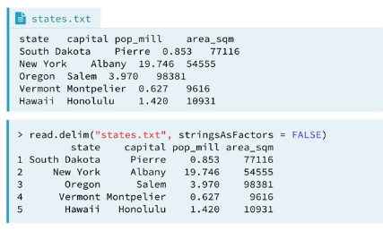
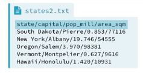
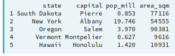
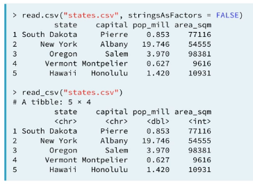
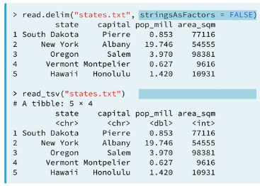
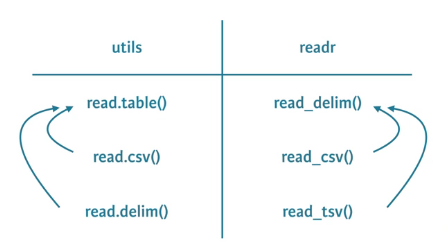
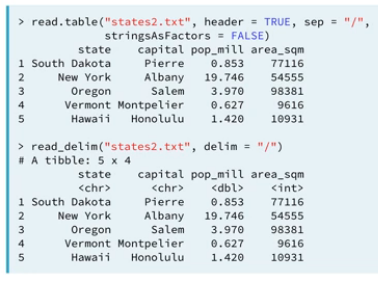
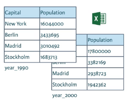

# Importing Data with R 
## Part 1

Anotações para o [curso do Datacamp](https://www.datacamp.com/courses/importing-data-in-r-part-1) ministrado pelo Filip Schouwenaars.

Aqui aprenderemos a importar dados no R para começar análises. Estaremos trabalhando com variados tipos de arquivos.

## Importing data from flat files with utils

O que faremos quando precisamos transitar de Excel para R?
Nesse curso aprenderemos a trabalhar com dados de 5 tipos de dados:
 
### Flat files, arquivos achatados

"Arquivos com estrutura de campos horizontal – cada registro corresponde a uma linha de dados onde os campos estão organizados posicionalmente ou por algum tipo de separador (vírgula, espaço em branco etc)" [Fonte](http://www.pt.bwconsultant.com.br/?p=63)

#### read.csv - vírgulas    
**O que fazemos quando os dados estão separados por _vírgulas_?**

CSV = Valores Separados por Vírgulas

```{r eval=FALSE}
wanted_df <- read.csv("states.csv", stringsAsFactors = False)
```


Se o arquivo não estiver no diretório de trabalho, terá que escrever o seu `PATH`(caminho). Por exemplo, se estiver na pasta denominada dados no seu diretório de trabalho, escrevá `"dados/state.csv"`.

Poderá alternativamente usar 
```{r eval=FALSE} 
caminho <- file.path("-", "datasets", "states.csv")
``` 
para encontrar a path que utilizará e guardar numa variável como caminho.

`stringsAsFactors` é `FALSE`, pois o default é `TRUE`, porém não queremos puxar os dados no formato de caracteres como categorias.

#### read.delim - indentação
**O que fazemos quando os dados estão separados por indentações?**
```{r eval=FALSE}
read.delim("states.txt", # path do arquivo
           colClasses = c("character", # OPCIONAL: colocar as  classes das colunas 
                          "character", #muito bom se quiser especificar apenas
                          "numeric",   #algumas colunas com caracteres como
                          "numeric"),  #categoria. "NULL" elimina a coluna.
           stringsAsFactors = FALSE)
```


#### read.table - qualquer formato
**O que faremos quando os dados estão malucos?**

A quantidade de argumentos são absurdos, devido a amplitude dos casos específicos possíveis. Vamos olhar o caso específico do arquivo `states2.txt`.



```{r eval=FALSE}
read.table("states2.txt",  # o path do arquivo
           header = TRUE,  # se a primeira linha são os nomes das variáveis
           sep = "/",      # o qu separa os dados
           stringsAsFactors = FALSE) # se as variáveis guardando caracteres são categorias.
```



Aprendizado aleatório:
max(), mostra o maior valor de um vetor
which.max(), mostra o local do maior valor

#### Conclusão - Wrappers
```{r eval=FALSE}
read.table() # é a forma genérica de
read.csv() # o wrapper para CSV e
read.delim() # o wrapper para arquivos .txt com indentação
```
Os últimos utilizam o primeiro com diferentes argumentos preformatados.

```{r eval=FALSE}
# São identicos
read.table("states.csv", header = TRUE, sep = ",", stringsAsFactors = FALSE)
read.csv("states.csv", stringsAsFactors = FALSE) 
# e
read.table("states.csv", header = TRUE, sep = "\t", stringsAsFactors = FALSE)
read.delim("states.csv", stringsAsFactors = FALSE) 
```
```{r eval=FALSE}
read.csv2() # e
read.delim2() # são configurações para diferenças regionais, lidando com 
              # separadores para decimais, etc.
```

#### Tidyverse

##### readr - csv em geral
Ambos abaixo puxam da mesma forma, porém a do Hadley automatiza algumas coisas como a questão das categorias. Porém a saída do read_csv é um tibble e não uma tabela.
```{r eval=FALSE}
library(readr)
read_csv("states.csv")
read.csv("states.csv", stringsAsFactors = FALSE) 
```

A função abaixo puxa arquivos texto separados por indentação.
```{r eval=FALSE}
library(readr)
read_tsv("states.txt")
read.csv("states.txt", stringsAsFactors = FALSE) 
```

A função principal é a read_delim()

Ambos abaixo puxam os mesmos dados.
```{r eval=FALSE}
library(readr)
read_delim("states.txt")
read.table("states.txt", header = TRUE, sep = "/", stringsAsFactors = FALSE) 
```


O argumento `col_names` pode ser usado para atribuir nomes de colunas, se for `FALSE` serão atribuídos nomes como X1, X2 e X3.
`col_types` especificam os tipos das colunas. Tem como simplificar esse input:
`"cidl_" == c("character", "double", "integer", "logical", "skip"")`

Outra forma de associar colunas a determinadas estruturas e tipos seria usando `collectors` ou coletores. Abaio temos os coletores as variáveis `fac` e `int`.

```{r eval=FALSE}
fac <- col_factor(levels = c("Beef", "Meat", "Poultry"))
int <- col_integer()
hotdogs_factor <- read_tsv("hotdogs.txt",
                           col_names = c("type", "calories", "sodium"),
                           col_types = list(fac, int, int))
```

Temos também o argumento `skip` que pula linhas, considerando a linha de nomes (portanto tendo que ser renomeadas), e `n_max` que limita a quantidade de linhas que serião puxadas. 

##### package (pacote) data.table:fread
Criados por Matt Dowle e Arn Srinivasan, esse pacote é muit rápido. Foi feito para manipulação de dados e tem uma função para importar dados `fread()`. É parecido com `read.csv()`. Todavia fread organiza os dados automaticamente, adicionando nomes quando não existem e aceitando os nomes quando existem, por exemplo. Ele faz as mesma coisas para separadores e os tipos das colunas.

```{r}
library(data.table)
```

Os argumentos `drop` e `select` funcionam para escolher quais colunas manter ao puxar uma série de dados. Servem tanto para especificar colunas por nome quanto por número.

```{r eval=FALSE}
fread("path/to/file.txt", drop = 2:4)
fread("path/to/file.txt", select = c(1, 5))
fread("path/to/file.txt", drop = c("b", "c", "d"))
fread("path/to/file.txt", select = c("a", "e"))
```


### Dados do Excel

#### readxl
Estaremos utilizando o `readxl` do Hadley Wickham, da tidyverse.
```{r}
library(readxl)
```
Arquivos Excel são dados no formato tabular agrupados por sheets.


Existem duas funções `excel_sheets()` e `read_excel`. O primeiro lista os sheets diferentes do arquivo excel, enquanto o segundo importa tal sheet como um tibble.
```{r eval=FALSE}
> dir()
[1] "cities.xlsx"

> excel_sheets("cities.xlsx")
[1] "year_1990" "year_2000"

> read_excel("cities.xlsx", sheet = número/nome do sheet)
# exemplos idênticos
> read_excel("cities.xlsx", sheet = 1)
> read_excel("cities.xlsx", sheet = "year_1990")

# uma forma mais rápida para puxar tudo seri por um lapply
> dados <- lapply(excel_sheets("cities.xlsx"), read_excel, path = "cities.xlsx")
```
##### Argumentos de read_excel
Existe o argumento `col_names` que leva TRUE, FALSE, ou c(nomes).
`col_types` leva tipos de colunas: text (texto), numeric (número), date (data) e blank (evitar a coluna).
`skip` pula linhas.
`n_max` é o máximo número de linhas a ler.

#### gdata

```{r eval=FALSE}
library(gdata)
```

Existem alternativas ao pacote anterior, vamos olhar esse do Gregory Warnes.
É uma série de ferramentas para manipulação de dados em inúmeras áreas.

Iremos utilizar o `read.xls()`. Não existe função para ler sheets separados. Usa a linguagem de programação Perl para funcionar. Ela converte os dados xls em csv, que depois é lido usando `read.csv`. Isso é bom pra quem conhece os argumentos de `read.table`, mas é muito ineficiente. 

Está sendo comentado aqui, pois no momento da gravação da aula, read_excel ainda estava sob forte modificação por ser novo e gdata já era mais estável.

##### Argumentos de read.xls

Todos os argumentos de `read.csv` podem ser utilizados.

#### XLConnect
Criado por Martin Studer, é a forma mais completa de trabalhar com arquivos de excel no R. Qualquer ação que você faria no Excel, consegue fazer dentro do R por meio da linguegem de programação Java.

Editar sheets de excel, formatar dados...

```{r}
library(XLConnectJars)
library(XLConnect)
```
É importante instalar "Oracle's Java Development Kit" (JDK) anteriormente: rJava.

O primeiro passo depois de carregar a biblioteca, é colocar o workbook numa variável.

```{r eval=FALSE}
book <- loadWorkbook("cities.xlsx")
```
Verificará olhando a estrutura que o objeto book é um workbook, que funciona como uma ponte entre R e Excel.

Para obter os nomes dos sheets podemos utilizar `getSheets(nome do arquivo)`.

Para ler os dados do sheet usamos `readWorksheet()`. Podemos usar o argumento `sheet` para especificar qual sheet queremos. Tem mais, podemos usar `startRow`, `endRow`, `startCol` e `endCol` para especificar exatamente qual quadrado de dados queremos.

Para fazer uma análise geral do arquivo como um todo, pode-se fazer o seguinte:

```{r eval=FALSE}
my_book <- loadWorkbook("urbanpop.xlsx")
sheets <- getSheets(my_book)
all <- lapply(sheets, readWorksheet, object = my_book)
str(all)
```


### Bases de Dados (PostgneSQL, MySQL)

### Web

### Software de Estatística (SPSS, STATA, SAS)


 
 